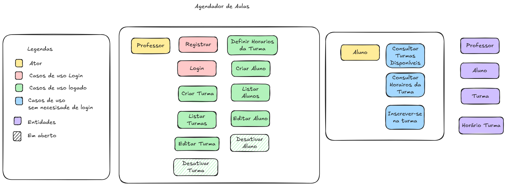

# Visão inicial do sistema

## 🖼️ Visão geral

A imagem acima representa a separação inicial entre:
- atores
- casos de uso do professor
- casos de uso do aluno sem login próprio
- entidades do domínio
- itens ainda em aberto

Esse desenho serve como base conceitual para a evolução do sistema.

## Objetivo desta etapa

Esta etapa tem como objetivo organizar a visão inicial do sistema antes de detalhar regras, dados, arquitetura ou implementação.

A ideia é separar de forma clara os elementos básicos do domínio para evitar confusão nas próximas decisões do projeto.

Nesta fase, o foco não está em modelar banco de dados nem definir estrutura técnica. O foco está em entender quem participa do sistema, quais ações existem e quais conceitos fazem parte do domínio.

---

## Escopo atual

O projeto é um agendador de aulas e montador de turmas para professores autônomos, com foco inicial em personal trainers.

Neste recorte, o sistema considera dois atores principais: professor e aluno.

O escopo atual inclui:

- autenticação do professor
- criação e gestão de turmas
- definição de horários da turma
- criação e gestão de alunos
- consulta de turmas disponíveis pelo aluno
- consulta de horários da turma pelo aluno
- inscrição do aluno na turma

Neste momento, não fazem parte do escopo:

- pagamento
- frontend
- login próprio para o aluno

---

## Separação conceitual

Antes de evoluir o sistema, é importante separar alguns conceitos que costumam ser confundidos no início de um projeto.

### Ator

Ator é quem interage com o sistema.

O ator representa um papel externo, ou seja, alguém que usa o sistema para executar ações.

No escopo atual, os atores principais são:

- Professor
- Aluno

---

### Caso de uso

Caso de uso é uma ação que o ator pode executar dentro do sistema.

Ele representa o comportamento esperado do sistema a partir de uma necessidade do usuário.

No escopo atual, os casos de uso identificados são:

#### Professor

**Autenticação**
- Registrar
- Login

**Gestão de turmas**
- Criar Turma
- Listar Turmas
- Editar Turma
- Definir Horários da Turma

**Gestão de alunos**
- Criar Aluno
- Listar Alunos
- Editar Aluno

**Itens em aberto**
- Desativar Turma
- Desativar Aluno

#### Aluno

Nesta fase, o aluno não possui login próprio. Sua participação ocorre por meio de interações operacionais sem autenticação formal na plataforma.

Os casos de uso atualmente identificados para o aluno são:

- Consultar Turmas Disponíveis
- Consultar Horários da Turma
- Inscrever-se na Turma

---

### Entidade

Entidade é um conceito do domínio que o sistema precisa conhecer e tratar como parte do negócio.

Ela não representa uma ação, e também não representa quem está usando o sistema. Ela representa algo que existe dentro da lógica do produto.

No escopo atual, os conceitos de domínio já identificados são:

- Professor
- Aluno
- Turma
- Horário da Turma

---

## Por que separar isso

Essa separação é importante porque cada elemento responde a uma pergunta diferente:

- ator → quem usa
- caso de uso → o que pode ser feito
- entidade → sobre o que o sistema está falando

Quando esses conceitos ficam misturados, o projeto tende a ficar confuso. Rotas, regras, modelagem de dados e arquitetura começam a nascer sem clareza.

Quando eles ficam separados, o sistema evolui com mais consistência.

---

## Aplicando isso ao projeto

No desenho atual:

- Professor aparece como ator porque é quem interage com o sistema administrativo
- Aluno aparece como ator porque participa do fluxo operacional do negócio
- Registrar e Login aparecem como casos de uso de autenticação do professor
- Criar Turma, Listar Turmas, Editar Turma e Definir Horários da Turma aparecem como casos de uso do professor autenticado
- Criar Aluno, Listar Alunos e Editar Aluno aparecem como casos de uso de gestão do professor autenticado
- Consultar Turmas Disponíveis, Consultar Horários da Turma e Inscrever-se na Turma aparecem como casos de uso do aluno sem necessidade de login próprio
- Professor, Aluno, Turma e Horário da Turma aparecem como entidades porque são conceitos do domínio do sistema
- Desativar Turma e Desativar Aluno já foram identificados como necessidades prováveis, mas ainda permanecem como decisões em aberto

Um ponto importante é que “Professor” pode aparecer em dois lugares diferentes sem estar errado:

- como ator, quando estamos olhando para a interação com o sistema
- como entidade, quando estamos olhando para o domínio do negócio

Essa distinção é normal e importante na modelagem.

---

## Resultado desta etapa

Ao final desta etapa, o projeto passa a ter uma base conceitual inicial organizada em grupos claros:

- quem interage com o sistema
- quais ações já foram identificadas
- quais conceitos fazem parte do domínio
- quais pontos ainda dependem de definição adicional

Com essa base, as próximas etapas poderão ser tratadas com mais clareza, como:

- regras de negócio
- fluxos
- modelagem de dados
- arquitetura
